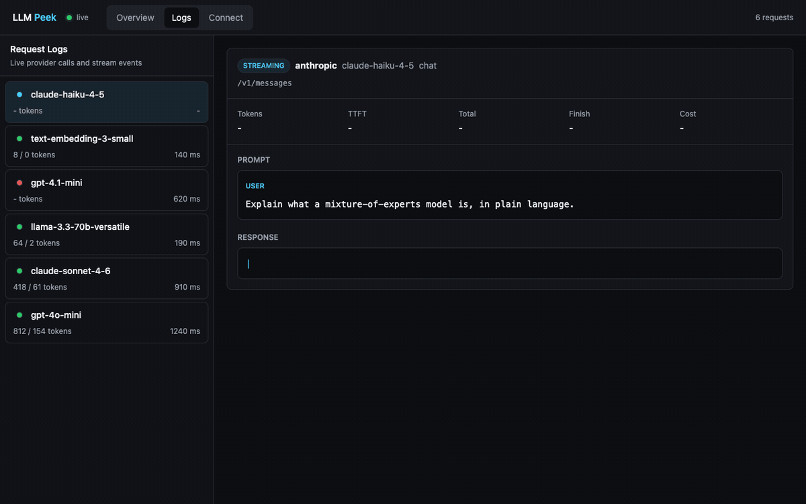
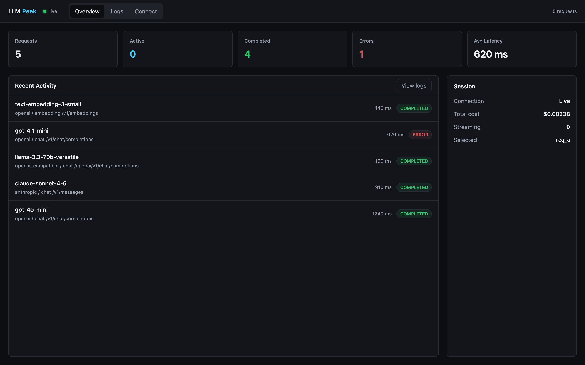
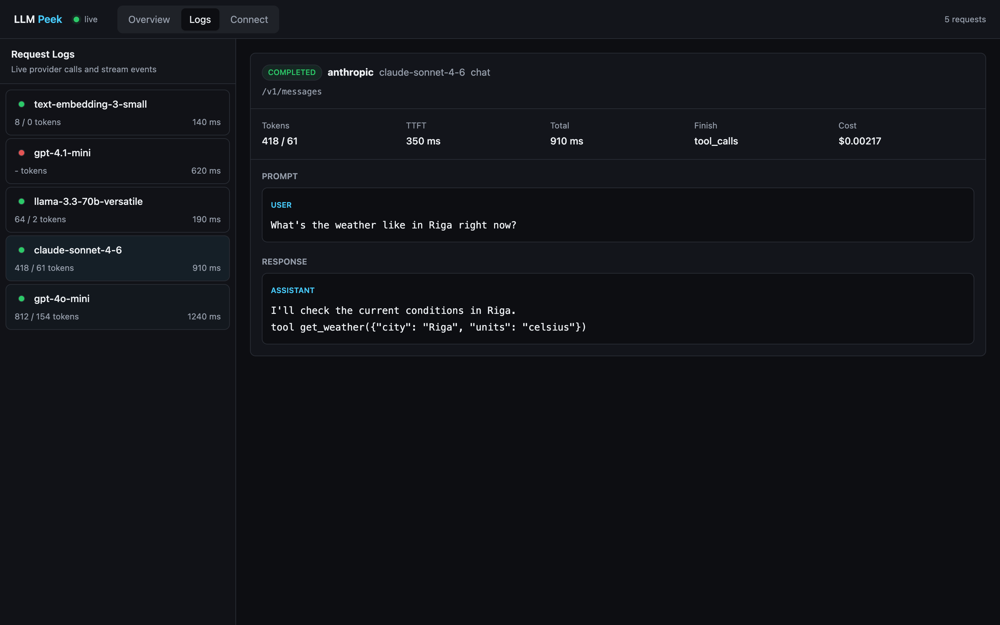

# LLMPeek

[](https://github.com/kristofers322/LLMPeek/actions/workflows/ci.yml)
[](LICENSE)
[](package.json)

See every LLM call your app makes, live. Add one import to a Node app, or run a
local proxy for anything else, and every request to OpenAI, Anthropic, or any
OpenAI-compatible API shows up in a dashboard on localhost: prompts, tool calls,
streaming output, tokens, latency and cost.

No account, no cloud, no config. Nothing leaves your machine.

<p align="center">
  
</p>

## Quick start

**In a Node app**, install once and import once, before your LLM SDK loads:

```bash
npm install --save-dev llmpeek
```

```js
import "llmpeek";
```

Run your app and open http://127.0.0.1:4319. The dashboard starts itself on the
first captured call. Using Next.js? See [below](#nextjs).

**For anything else** (Python, Go, curl, whatever), start the proxy:

```bash
npx llmpeek
```

Then, in the shell your program runs in:

```bash
source .llmpeek/env.sh
python your_app.py
```

The proxy decrypts traffic to known LLM hosts only, using a locally generated CA
that never touches your system trust store. All other HTTPS is tunneled through
untouched.

## What you get

Every request in one place: the full prompt, the response as it streams, tool
calls with their arguments, finish reasons, token usage (cached and reasoning
tokens included), latency and estimated cost.





## Supported providers

- **OpenAI**: chat completions and embeddings, streaming included
- **Anthropic**: the Messages API, streaming, extended thinking, prompt caching
- **OpenAI-compatible**: Groq, OpenRouter, Together, Mistral, DeepSeek,
  Perplexity, x.ai, Fireworks, Azure OpenAI, and self-hosted Ollama or vLLM

Costs come from a bundled LiteLLM pricing snapshot; unknown models show no cost
rather than a wrong one. The native Gemini and Cohere APIs are not decoded yet.

## Configuration

Everything works with zero config. When you need to change something:

| Env var | Default | What it does |
| --- | --- | --- |
| `LLMPEEK` | on in dev | `1` or `0` forces capture on or off |
| `LLMPEEK_REDACT` | `credentials` | `content` also masks prompts, responses and tool args |
| `LLMPEEK_PORT` | `4319` | dashboard and collector port |
| `LLMPEEK_PROXY_PORT` | `4318` | proxy port |
| `LLMPEEK_HOSTS` | none | extra hosts for the proxy to intercept, comma-separated |
| `LLMPEEK_LOG_MAX_MB` | `100` | rotate the event log past this size |

Or from code:

```js
import { configure } from "llmpeek";

configure({
  redact: "content",   // mask prompt and response text, keep tokens and cost
  enabled: true,       // force capture on or off
  sink: (event) => {}, // receive every captured event yourself
});
```

<a id="nextjs"></a>

### Next.js

A bare import does not reliably load before your SDK, and it must never run on
the Edge runtime. Use the instrumentation hook:

```js
// instrumentation.ts
export async function register() {
  if (process.env.NEXT_RUNTIME === "nodejs") {
    await import("llmpeek");
  }
}
```

```js
// next.config.js
module.exports = {
  serverExternalPackages: ["llmpeek"], // Next 15+. On 13-14 use experimental.serverComponentsExternalPackages
};
```

## Privacy

- The dashboard and collector bind to `127.0.0.1`. Nothing is uploaded, ever.
- Capture is off by default in production, CI and serverless environments.
- Captured events, including prompt text, are logged to `./.llmpeek/events.ndjson`,
  so add `.llmpeek/` to your `.gitignore`. Set `LLMPEEK_REDACT=content` to keep
  structure and stats but mask all text. API keys are always stripped.

## Development

npm workspaces monorepo:

| Package | Role |
| --- | --- |
| `packages/schema` | event contract, TS types plus JSON Schema |
| `packages/node` | the published `llmpeek` package (interceptor, proxy, CLI) |
| `packages/collector` | local server: HTTP, WebSocket, NDJSON log, cost enrichment |
| `packages/dashboard` | Svelte dashboard served on localhost |

```bash
npm install
npm run build
npm test
```

The collector and built dashboard are bundled into `llmpeek` at publish time, so
installing stays a single package. Node 18.19 or newer.

## License

MIT. Built by [Kristofers Gulbis](https://github.com/kristofers322) and
[Mason Salter](https://github.com/masonsalter).
